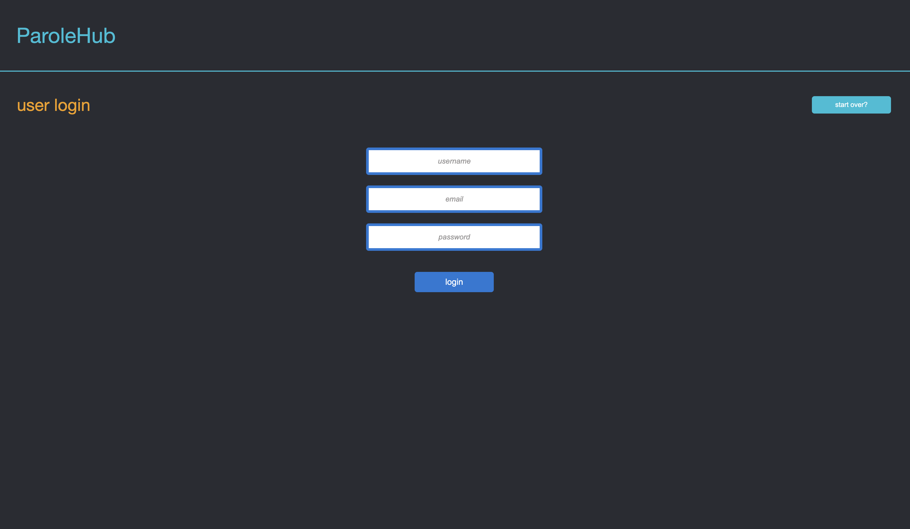
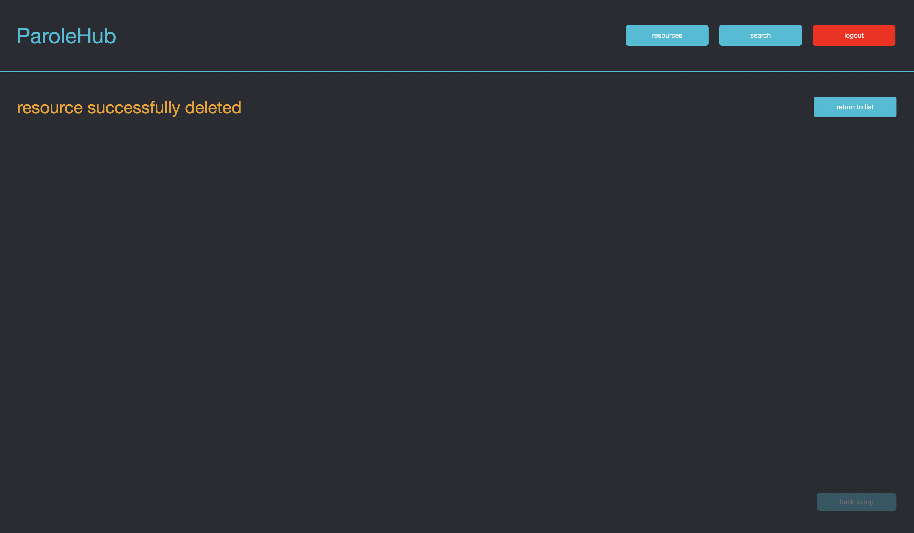

<!-- Richie T-57866 -->

#Richie's Markdown For The Thesis Project (Revised)

## Home

* [Getting Started](#getting-started)
* [Home Page](#home-page)
* [Sign Up Page](#sign-up-page)
* [Login Page](#login-page)
* [Main Page](#main-page)
* [Search](#search)
* [Zipcodes](#zipcodes)
* [County](#county)
* [Name](#name)
* [Support Priveleges](#support-priveleges)
* [Resources](#resources)
* [Admin Priveleges](#admin-priveleges)
* [Users Page](#users-page)
* [Errors](#errors)
* [New Feature: User Authentication](#new-feature:-user-authentication)
* [What I Learned](#what-i-learned)

## Intro To Project

- This project was made to complete the assignment `Thesis Project` for the Mern class.
- The project was completed using only the tool and modules taught in the class so far(`react`, `node`, `express`, `mongo`, `mongoose`, `cors`, `nodemon`).
- The project was completed without using `jQuery`.
- Almost all of the photos in this project were downloaded from 'Pexels.com'.

## Getting Started

### Mongo and Server

- The very first thing the user needs to do is start up `mongo` on their computer. If the user does not have `mongo` installed please `Google` for instructions on how to install `mongo` locally.
- Once `mongo` is up and running, open a terminal window and cd to the `server` folder in the app directory.
- Type the following: `mongorestore --host localhost --port 27017 --db reentry-project dump/reentry-project` to install the `ParoleHub` database locally.
- Run `npm install` because there is no `node_modules` folder included for the server portion of this app.
- *** Note *** The npm packages are a little dated so you may receive a message like:
    `"1 moderate severity vulnerability"`.
    You may need to run "npm audit fix --force" to install the necessary modules.
- Make sure nothing is currently running on `port 8000`.
- Run `npm start`.
- It should be running on `port 8000`.

### Client

- Open another terminal and cd to the `client` folder in the app directory.
- Run `npm install` because there is no `node_modules` folder included for the client portion of this app.
- Make sure nothing is currently running on `port 3000`.
- Run `npm start`.
- It should be running on `port 3000`.
- A tab should automatically open in the browser at url `localhost:3000`.

## Home Page

- The `Home` page should look like this:
    
    
    
    
    
    
- In the upper-right corner of the page there are 2 buttons marked `Sign Up` and `Login`.
- We will start with `Sign Up`.

## Sign Up Page

- The app will take the user to a page that will give the user the ability to sign up on the app.
- There are 3 different types of status that a user can have (`Admin`, `Support`, `User`).
- Signing up will give the user `User` status, the most basic privileges on app.
- The `Sign Up` page should look like this:
    
- When a new user signs up, the user's password will be encrypted using `BCrypt`.
- The app will not allow a potential user to have an existing `email` of another user.
- Next will be the `Login` page of the app.

## Login Page

- The app will take the user to a page that will give a user with existing priveleges the ability to log on to the app.
- The `Login` page should look like this:
    
- Whether the user is new to the app or a user with existing priveleges, the next page is the `Main` page.
- Either sign-in as a new user or login like this:
- In the `username` bar: `Basic User`.
- In the `email` bar: `basic@gmail.com`.
- In the `password` bar: `password`.

## Main Page

- The `Main` page should look like this:
    ")
    ")
    ")
- Throughout the app the user can click the `ParoleHub` logo to return to this page.
- In the upper-right corner of the page there are 2 buttons marked `search` and `logout`.
- We will start with `search`.

## Search

- When the user clicks the `search` button, the app will take the user to the `search by` page.
- The `search by` page should look like this:
    
- The app will give the user options to choose from `zipcodes`, `county`, `name`.
- The app will allow the user to search the database by the means that the user selects.
- *** Note *** For the `county` or `name` searches, letter-case is irrelevant.
- We will start with `zipcodes`.

## Zipcodes

- When the user clicks the `zipcodes` button, the app will take the user to the `zipcode searched` page..
- The page should look like this:
    
- The user can then click the `input zip here` bar bordered in pink and input any Zip Code in California.
- *** Note *** The app is currently designed only for California Zip Codes, but it can be easily expanded to include other states.

### Results

- The app will return all of the resources within a 45 mile radius of the Zip Code entered.
- The results will sorted by distance from the resource closest to the Zip Code entered to the farthest away.
- Results that the same distance away will be sorted alphabetically.
- *** Note*** I focused most of the resources in the database on northern California. For this demostration I will use a Zip Code from San Francisco: `94102`.
- The results should look like this:
    
- The user can also filter the results to only display results that contain any selected `Keyword`.
- If the user clicks a `Restriction`, the app will only display results that contain all of the restrictions selected.
- To do so, the user must first click the `Filters Open` button located in the upper right section of the app.
- The results should look like this:
    
- Once the user makes their selection, the app dynamically filters the set of results.
- For demonstration, I will click the `Library` keyword button for the current set of results.
- The filtered results should look like this:
    ")
- Notice how the message includes the words `filtered results` to let user know that s/he/they are using filters.
- The selected filters will remain in place as the user makes additional searches.
- To remove the selected filters the user can either click the selected filter again or click the `Refresh Filters` button at the top of the `Filters` section to remove all selections.
- To close `Filters` section the user can click any area outside of the `Filters` section, or scroll down in mobile versions.

### Display Result

- The user can either scroll and click a result with the mouse or tab through results and press `return` to display the full information of the result. I will scroll down the page and choose `Result 5`.
- *** Note *** With the addition of the filters, I need to make adjustments for the tab capabilities.
- The page should look like this:
    ")
    ")
- The user can click `return to list` to choose another result.
- The user can also click the `previous` button to go to the preceding result or the `next` button to go the following result.
- We will click `return to list`, click `filters open`, and click `Refresh Filters` before we start our next search so that we are not just searching for libraries.

## County

- Let's click the `search` button again and go back to the `search by` page.
- This time we will search by `county`.
- When the user clicks the `county` button, the app will take the user to the `county searched` page..
- The page should look like this:
    
- The user can then click the `input zip here` bar bordered in pink and input any county in California.
- For example, the user can input `San Francisco` or `San Francisco County`.
- *** Note *** The app is currently designed only for California Counties, but it can be easily expanded to include other states.
- We will type in `San Francisco`.

### County Results

- The app will return all of the resources within the county entered.
- The results will sorted by Zip Code and alphabetically for each Zip Code group.
- The results should look like this:
    
- The user can then use the `Filters` to tailor the results.

## Name

- Let's click the `search` button again and go back to the `search by` page.
- This time we will search by `name`.
- When the user clicks the `name` button, the app will take the user to the `name searched` page..
- The page should look like this:
    
- The user can then click the `input zip here` bar bordered in pink and input of any resource in California.
- *** Note *** The app is currently designed only for California Resources, but it can be easily expanded to include other states.
- We will type in `healthright 360`.

### Name Results

- The app will return all of the resources with the name entered.
- The results will sorted by Zip Code and alphabetically for each Zip Code group.
- The results should look like this:
    
- The user can then use the `Filters` to tailor the results.

## Support Priveleges

- To gain `Support` status, login like this:
- In the `username` bar: `Support User`.
- In the `email` bar: `support@gmail.com`.
- In the `password` bar: `password`.
- If the user that logs on has `Support` status, the `Main` page will have more options and will look like this:
    ")
- `Support` status will give the user the ability to enter and update resources.

## Resources

- When the user clicks the `resources` button, the app will take the user to the `resources` page.
- The `resources` page should look like this:
    

### Enter Resources

- When the user clicks the `enter` button, the will take the user to the `enter resource` page which should look like this:
    ")
    ")
    ")
- The user enters a Resource by filling out the input fields and clicking the buttons with the appropriate information for the Resource.
- When the properly enters a Resource, the app will inform the user of the success which will look like this:
    
- The user can click the `enter another?` button to enter another resource.

### Update Resource

- To update a resource, let's go back to the resource we looked at earlier (Zip Code `94102`, filter `Library`, result `5`).
- With the ability to update, the page should look like this:
    ")
- The user clicks the `update` button and the app will take the user to the `update resource` page which looks `enter resource` page with the information already filled out.
    ")
    ")
    ")
- When the user properly updates a resource, the app will inform the user of the success which will look like this:
    
- The user can click the `back to resource` button to go back to the display page for the result.
- The user can click the `delete` button to delete a resource as well.
- When the user deletes a resource, the page will look like this:
    
- The `return to list` button will take the user back to the list of resources in the Zip Code previously searched.

## Admin Priveleges

- To gain `Admin` status, log on like this:
- In the `username` bar: `Admin`.
- In the `email` bar: `admin@gmail.com`.
- In the `password` bar: `password`.
- If the user that logs on has `Admin` status, the `Main` page will have more options and will look like this:
    ")
- `Admin` status will give the user the ability to enter and update resources.

## Users Page

- When the user clicks the `users` button, the app will take the user to the `users` page and display the list of all current users except the current user to avoid mishaps like deleting your own priveleges.
- The `users` page should look like this:
    

### Update Users Page

- For this demonstation, I will update `newguy` by clicking the `User 2` link.
- The `update user` page should be a form with the selected user's information filled out and look like this:
    
- The user can either update or delete the selected user.
- If the user changes any of `newguy's` info and clicks update, the app will change the information.
- If the user leaves the password input bar blank, `newguy's` password will remain the same.
- Otherwise, the password will changed to whatever the user inputs and then the password will be hashed before being stored in the Mongo database.
- Upon a successful update, the page will look like this:
    
- Upon a successful delete, the page will look like this:
    
- The user can click the `back to users` button to go back to the list of users.

### Enter Users Page

- On the `users` page, the user can click `add new?` button to add a new user.
- The `enter user` page should look like this:
    
- The user can give the user being created any status they want by clicking the appropriate button.
- When a user is successfully created, the page should look like this:
    
- The user can then either click `enter another?` to enter another user or click any button of his/her/their choice.

## Errors

- The app should account for the basic errors of using it like typing in something that is not a Zip Code or a Zip Code that does not exist. Hopefully you will not find any more. :)

## New Feature: User Authentication

- I added User Authentication to the app to upgrade it from the `Compentency Project`.
- User Authentication provides a safer environment for the app. By not allowing all users an all access pass to the app, I protect the integrity of the app and it's information.
- Also, I went with User Authentication because I find it very interesting. I'm a Math person, so algorithms and such are very cool to me (Even the ones I don't come close to understanding :) ).
- I used  the example from the `Authentication (optional: for Thesis Project)` section of `Canvas` for the `Mern` Track for this app.
- Upon successful creation of a user, `BCrypt` sends the user's password through it's algorithm process and what is returned is a hashed version of the password.
- When the user logs in, the password the user enters is hashed as well. The hashed password that is entered is then compared by `BCrypt` to the hashed password stored with the user's info.
- If the passwords are a match, the user is allowed access.
- Matching hashed passwords are not necessarily the same sequence of characters. It just means they are equivalent results of the `BCrypt` hashing process.
- If the user's password is not valid, the user will receive an error message that will look like this:
    
- If the user's password is valid, the session will be provided a token using `JWToken` and stored on `localstorage`.
- If someone tries to use the app with a bogus token, or the valid token is somehow altered on `localstorage`, or the 24 hour time limit for the token runs out, the user will kicked out of the app.
- The user's status is constantly checked throughout the app.
- If a user tries to access a page above their status, like `Basic User` trying to go url `http://localhost:3000/users`, the user will be sent to this page:
    

## What I Learned

- I learned about `react` and how complex, yet powerful, it is.
- I learned how to use `useState` and `useEffect` together.
- I learned how to use `Switch` for my routes.
- I learned about `User Authentication`.

- Thank you again to Jon Levin and Rob Tyler who helped me put the Band-Aids on this app.

* [Home](#home)